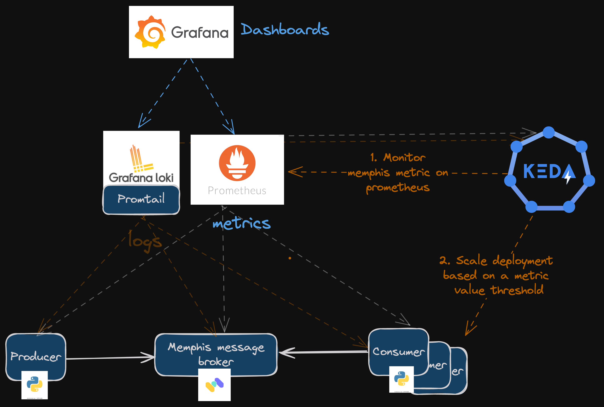

# Scalable Event-Driven System with Kubernetes and KEDA

This project implements a scalable, event-driven system using Kubernetes, with automatic scaling handled by KEDA based on the number of messages in the queue. It consists of an event producer application that generates messages at variable rates and an event consumer application that processes these messages.




## Prerequisites

- A running Kubernetes cluster (v1.29 tested)
- Operating System: Linux or Mac OS.
- [Werf](https://werf.io/documentation/v1.2/#installing-werf)
- [Taskfile](https://taskfile.dev/installation/)
- [Helm](https://helm.sh/docs/helm/helm_install/)
- [Helmfile](https://helmfile.readthedocs.io/en/latest/#installation)
- [kubectl](https://kubernetes.io/docs/tasks/tools/install-kubectl-linux/)
- Python3: Ensure Python3 is installed on your system.
- Docker: Make sure Docker is connected to a docker registry with an existing empty repository `<repo>`

## Assumptions

**Given the limited time frame of three days, the system was designed with the following assumptions:**

- **Idempotency**: Sending and receiving messages are idempotent, preventing network issues from causing unacknowledged messages or acknowledgment timeouts. The system adheres to exactly-once semantics.
- **Single-Core Processing**: Assumes single-core to simplify development, despite modern multi-core, multi-thread capabilities. This simplifies ensuring message order without designing for multi-processing.
- **Schema Flexibility**: The system doesn't enforce message schemas, allowing for greater flexibility.
- **Self-Hosted Approach**: Chosen to ease scalability testing and eliminate network-related complexities by running everything on the same machine.


## Infrastructure Choices

### Messaging System: Memphis

Memphis was chosen as the messaging system for this project due to its suitability for scenarios requiring low latency and high message throughput, characteristics vital for transactional models as opposed to high-volume analytics. This decision was driven by the challenge's emphasis on scalability metrics focused on queue message counts, necessitating systems optimized for performance in these areas. While solutions like Kafka were considered, they were ultimately excluded due to their design priorities, which do not align as closely with our needs for minimal latency. Similarly, although ZeroMQ offers advanced capabilities, its lack of native support for stream lineage and replay mechanisms led us to seek alternatives. RabbitMQ, with its native administrative-oriented interface, also fell short of our requirements for a more developer-friendly message tracing experience. Memphis stands out by combining a user-friendly interface for message tracing with exceptional performance metrics, significantly surpassing RabbitMQ in terms of latency and message handling capacity. This blend of features makes Memphis an ideal choice for enhancing our system's debugging capabilities while ensuring efficient message processing.


### Developer Experience

**Werf**: To streamline my workflow and reduce lead times for changes, I opted for Werf. It simplifies the build, push, and deploy processes for Kubernetes images into a single command post-configuration with a `werf.yaml` file. While other solutions like DevSpace and Kubernetes-native PaaS options such as Kubero or Kusion offer similar functionalities, Werf was selected for its minimal overhead. It allows for direct manipulation of Kubernetes manifest files, which is crucial for creating and managing KEDA `ScaledObject` CRDs with ease. Additionally, Werf's default integration with GitOps principles (git-determinism) further aligns with our project's needs for simplicity and efficiency in continuous delivery.

**Taskfile**: For executing commands with greater ease and user-friendliness, Taskfile was chosen over Makefile. This preference stems from Taskfile's approachable syntax and utility, making it an invaluable tool for developers seeking to optimize their workflow without sacrificing control or capability.

This combination of Werf and Taskfile significantly enhances my developer experience by reducing complexity and enabling faster iteration cycles, ensuring that the focus remains on delivering high-quality code efficiently.


### Ops Experience

For deployment and configuration management, helmfile was chosen over tools like ArgoCD or Flux for its simplicity and direct command line interaction, offering ease of iteration.

### Configuration and Secret Management

**Secrets**: For secret management, Kubeseal was chosen to minimize external dependencies, aligning with the project's principle of building from scratch. While external secret solutions like the External Secrets Operator, Infiniscale, or Doppler offer robust capabilities, especially for pre-existing cloud secret stores, the goal was to avoid adding unnecessary external dependencies.

**ConfigMaps**: Similar to the approach with secrets, ConfigMaps were directly utilized for managing configurations. This decision was driven by the need for simplicity and direct control over application settings, including rate configuration. The ability to modify rate settings in ConfigMaps and have those changes automatically trigger application redeployments—without manual intervention—was crucial. For this, Stakater Reloader was used, ensuring seamless updates to the producer application based on ConfigMap changes.


### Container Registry

Docker Hub was chosen for its familiarity and wide adoption, avoiding the need for setting up an internal Docker registry in Kubernetes.

### Observability

The selection of Prometheus and Grafana for metrics collection and monitoring was guided by their native integration ease, particularly with Memphis. The key metric `memphis_consumer_num_pending` provided by Memphis was a critical factor in this choice, as it offers direct insight into the number of messages pending in the queue. Finally, Loki was incorporated for its log aggregation capabilities. 


## Code Choices

### Programming Language

Python was chosen because it's programming language I know best

### Libraries

- `decouple` for separating configuration from code.There are laternatives, notably hydra, which is widely used in datascience, but the use case wasn't worth the trouble.
- `backoff` for specifying retry logic with decorators. I prefer it to `retry` lib as it allows to retry only for specific exception using decorator
- `loguru` for simplified logging and context loggers whcih helps me add easily consumer name on each conumer log

### Observability

In this implementation, the focus for observability has been placed solely on logging. Given that the code only interacts with an external service and considering the project's time constraints, adding metrics and tracing was not prioritized. 

However, the idea of introducing custom metrics, especially to measure message processing latency (the time it takes for a message to be sent to the queue or event source and then fully processed by the consumer), was appealing. Such a metric would utilize a unique identifier for each message and would with Prometheus.

Opting to focus on logs rather than a comprehensive observability system was a pragmatic decision, driven by the project's immediate goals and time limitations. This approach was chosen to ensure direct and manageable visibility in the early stages.


### KEDA Scaling Parameters

In configuring the KEDA `ScaledObject`, I opted for a notably short cooldown period and polling interval to facilitate rapid testing of scaling up and down. This approach enabled immediate feedback on how the system responds to fluctuating demand.

However, I am aware that while these settings are advantageous for development and testing environments, allowing us to quickly observe and adjust scaling behavior, they might not be suitable for production use. Short cooldown and polling intervals can lead to frequent scaling actions, potentially straining the metrics server or encountering rate limits with external metrics sources. Additionally, such aggressive scaling can introduce instability or unnecessary costs.


## Getting Started

### Infrastructure deployment

1. **Install Required Components**:
   If starting with a new Kubernetes cluster, you can install all necessary components by executing the following command:
   ```bash
   task infra -- apply
   ```
   If some components are already installed, you may need to comment out those parts of the script to avoid conflicts.

2. **Expose Memphis API and UI Locally**:
   To access the Memphis API and UI on your local machine, run:
   ```bash
   task expose
   ```
   Then, open your browser and navigate to `http://localhost:9000` to proceed with the setup. Here, you'll need to create a client accounts. I suggest to use **username** and **password** values specified in your `.env` file.Here are the [guidelines](https://www.loom.com/share/559eca17382248a3a015a38be85d8ec4) 
   <u>If you use different values, please ensure to .env accordingly.</u> 
   

3. **Verification**:
   Launch the producer and consumer applications in separate shells:
   - For the consumer:
     ```bash
     task run ROLE=consumer
     ```
   - For the producer:
     ```bash
     task run ROLE=producer
     ```
   You should see activity indicating successful message production and consumption (this can be visually verified with shell gif recordings if available).

4. **Monitoring Messages**:
   Additionally, you can view the message flow and verify the system's operation via the Memphis Station UI, accessible after the local exposure setup.


## Application Deployment

If you have changed default username/password below, you'll need to update the `sealed-secret.yaml` by sealing your new secret. Use the following command to overwrite the existing one:

```bash
cat secret.yaml | kubeseal \
    --namespace app \
    --controller-namespace kube-system \
    --controller-name sealed-secrets \
    --format yaml \
    > sealed-secret.yaml
```

where `secret.yaml` should look like this:

```yaml
apiVersion: v1
kind: Secret
metadata:
  name: "secret"
type: Opaque
data:
  USERNAME: <base64-encoded-username>
  PASSWORD: <base64-encoded-password>
```

>**Note**: ⚠️ The Memphis service utilized locally uses the same keys as those configured in Kubernetes for demonstration purposes. However, this setup is not recommended for production environments.

Then, deploy using the Taskfile command:

```bash
task deploy REPO=<repo>
```
>Images deployed via above command pushed consumer/producer in the same repo with hash difference. This is oki for test purpose but not for real environment

and verify everything is oki:

```bash
kubectl get pods -n app
```


## Observability

To access Grafana for system monitoring, execute the following command:

```bash
kubectl port-forward service/prometheus-grafana 8066:80 --namespace default
```

Next, log in using the default credentials: **username:** `admin` and **password:** `prom-operator`.

### Importing Dashboards

- For Memphis monitoring, import the dashboard from Grafana's website: [Memphis Dashboard](https://grafana.com/grafana/dashboards/18050-memphis-dev/).
- Additionally, import the local dashboard file named `Camb.ai-1710382423118.json` for customized insights.

## KEDA scalability testing

To test the scalability of your system, follow these steps:

1. Open the previous dashboard dashboard
2. Execute the command below to modify the rate at which messages are produced:

```bash
task update-rate RATE=0.1
```

You should observe an increase in the queue's message count and consumer replicas in the dashboard.

3. After witnessing the changes, adjust the rate back to a higher frequency:

```bash
task update-rate RATE=120
```
Within approximately 30 seconds, the number of consumer replicas should scale down to 0, demonstrating the system's ability to dynamically adjust to varying workloads.


## Troubleshooting

### Issue: Failed Update Rate

If you encounter an error when attempting to update the rate, like the following:

```bash
task: [update-rate] kubectl patch configmap producer-configmap -p '{"data":{"RATE":"60"}}'
Error from server (NotFound): configmaps "producer-configmap" not found
task: Failed to run task "update-rate": exit status 1
```

This indicates that the application has not been deployed yet. Ensure you deploy the application as per the provided deployment instructions.

### Teardown Procedures

Should you need to remove the application:

```bash
task teardown REPO=<repo>
```

For tearing down the infrastructure, use:

```bash
task infra delete
```
